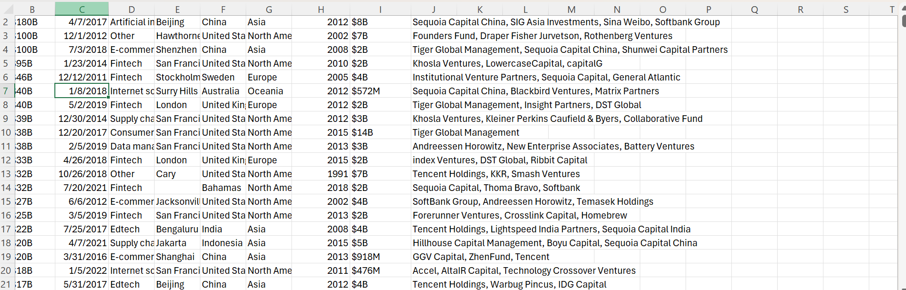
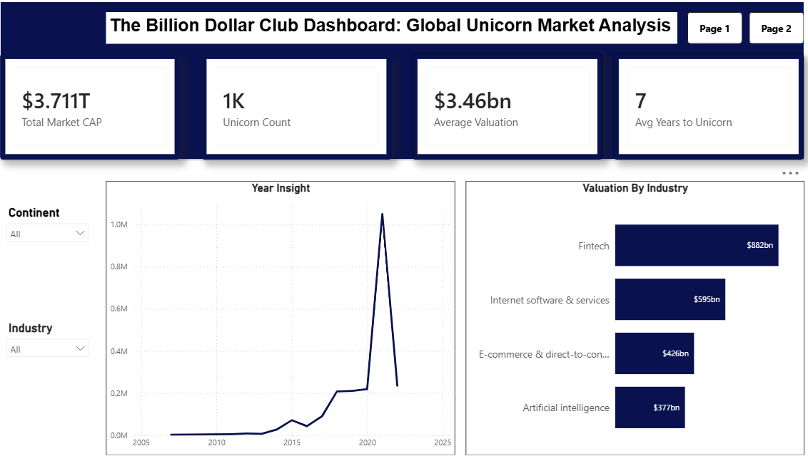

# The Billion Dollar Club:Global Unicorn Market Analysis

## Executive Summary
This dashboard analyzes the global unicorn market, highligting company valuation, industry performance, geographical distribution, and funding trends.The dataset contains approximately 1,000 unicorn companies with a combined valuation of $3.711 trillion and an average valuation of $3.46 billion.

## Business Context
Unicorn companies are privately owned startups valued at over $1 billion. This Power BI dashboard was developed to analyze the global unicorn ecosystem, identify valuation trends, compare industry performance, and understand the relationship between funding and company valuation.

## Objectives 
- Analyze the overall valuation of global unicorn companies.
- Identify the top-performing industries by valuation.
- Examine unicorn growth trends over time.
- Explore the geographical distribution of unicorn companies.
- Assess the relationship between funding received and company valuation.

  ## Data Overview
  The dataset contains information on approximately 1,000 unicorn companies worldwide, including Company Name, Industry, CountryContinent, Valuation, Funding Amount, Year Founded, Year Achieved Unicorn Status

  ## Data Preview
  

  ## Key findings
- The global unicorn market is valued at $3.711 trillion.
- There are approximately 1,000 unicorn companies in the dataset.
- Startups take an average of 7 years to achieve unicorn status.
- Fintech is the highest-valued industry at $882 billion.
- Unicorn growth remained slow between 2010 and 2015, increased steadily through 2020, and experienced a major surge around 2021.
- North America and Asia host the highest concentration of unicorn companies.
- Companies with higher funding generally achieve higher valuations.

[Link to the live dashboard](https://app.powerbi.com/view?r=eyJrIjoiNjAyNmMxMTEtZjQyYy00NzY3LTg0ODgtZTQ2N2RlMThjMDMyIiwidCI6IjQ2MmRiMWY5LWIxMTktNGIzYi1iMDc2LTVhNGZmMzc3NDcyZSJ9&disablecdnExpiration=1780066412)

## Data Cleanig & Transformation 
The dataset was cleaned and transformed using Power Query in Power BI by:
- Removing duplicate records.
- Handling missing and inconsistent values.
- Correcting data types for dates and numerical fields.
- Creating calculated measures for key KPIs such as Total Market Valuation, Average Valuation, Unicorn Count, and Average Years to Unicorn Status.
- Preparing the dataset for visualization and analysis.

 ## Detailed Findings & Analysis
  ### Key Performance Indicators (KPIs)
  
  ### Total Market Capitalization: 
- The global unicorn market is valued at $3.711 trillion, indicating a highly valuable startup ecosystem.
 ### Unicorn Count:
- The dataset contains approximately 1,000 unicorn companies worldwide.
 ### Average Valuation:
- The average valuation per unicorn company is $3.46 billion.
 ### Average Years to Unicorn:
- Companies take an average of 7 years to achieve unicorn status.

  ## Recommendation
- Investors should focus on high-growth sectors such as Fintech and Artificial Intelligence.
- Emerging markets should encourage startup funding to increase unicorn creation.
- Businesses should prioritize innovation and scalability to attract investment.

  ## Tools Used
- Power Query: Data cleaning and transformation
- Power BI: Data analysis and visualization

  ## Conclusion
  The analysis shows that the global unicorn ecosystem continues to expand rapidly, driven by technological innovation, strong investor interest, and growing startup funding. Fintech remains the leading sector, while North America and Asia continue to dominate the unicorn landscape.
